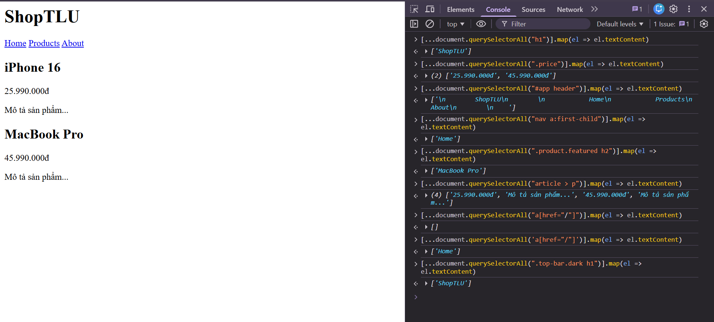

1. h1                   
→ Chọn:
```h1 (ShopTLU)```
2. .price               
→ Chọn:
```Hai đoạn (p) có thuộc tính price (25.990.000đ, 45.990.000đ)```
3. #app header          
→ Chọn:
```header nằm trong div có id=app (ShopTLU, Home, Products, About)```
4. nav a:first-child    
→ Chọn:
```Thẻ a đầu tiên trong nav (Home)```
5. .product.featured h2         
→ Chọn:
```h2 của thẻ có thuộc tính product featured (MacBook Pro)```
6. article > p                  
→ Chọn:
```Thẻ p trực thuộc article (25.990.000đ, Mô tả sản phẩm..., 45.990.000đ)```
7. a[href="/"]                  
→ Chọn:
```a có thuộc tính [href="/] (Home)```
8. .top-bar.dark h1              
→ Chọn:
```h1 của thẻ có thuộc tính top-bar dark (ShopTLU)```

